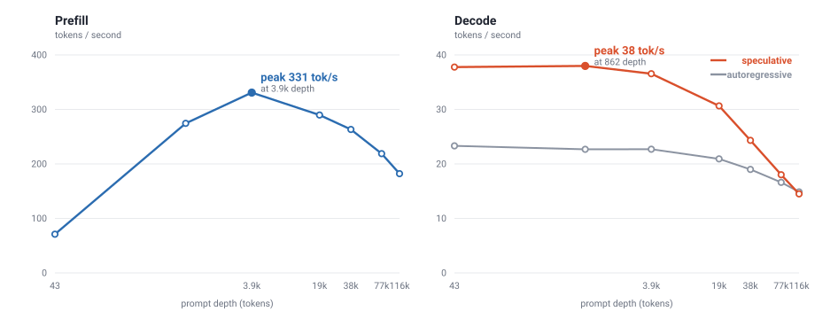

# Ember

<p align="center">
  
</p>

<p align="center">
  <strong>DeepSeek-V4-Flash inference for AMD Strix Halo</strong>
</p>

> [!IMPORTANT]
> **Ember is designed exclusively for AMD Strix Halo (`gfx1151`).** It is an
> intentionally focused engine for one APU platform and one model family,
> allowing its CPU, GPU, unified memory, and optional XDNA2 NPU path to be
> tuned together. It is not a general-purpose inference engine and does not
> support other GPU or NPU architectures.

Ember is a C inference server for DeepSeek-V4-Flash. It provides OpenAI Chat
Completions, OpenAI Responses, Anthropic Messages, and legacy Completions APIs
on one local endpoint.

**23-40 tok/s decode, 194 ms warm TTFT** on a single Ryzen AI Max 395+.
[Details below.](#performance)

## Requirements

- Native x86_64 Linux on AMD Strix Halo (`gfx1151`)
- Approximately 128 GiB unified memory
- At least 100 GiB free disk space
- Docker Engine with Docker Compose v2
- `/dev/kfd` and `/dev/dri` available to Docker

Docker Desktop, virtualized GPU passthrough, and other GPU architectures are not
supported. The normal release uses the GPU and CPU only. The opt-in XDNA2 image
additionally requires a working host `amdxdna` driver, firmware, IOMMU
translation, and `/dev/accel/accel0`.

## Start Ember

From the repository root:

```bash
scripts/preflight.sh && docker compose up -d
```

The first start pulls the [current Ember release](https://github.com/otheru-ai/ember/releases/latest)
image pinned in [`compose.yaml`](compose.yaml), downloads the pinned
[DeepSeek-V4-Flash Strix Halo model and DSpark drafter](https://huggingface.co/otheru/DeepSeek-V4-Flash-Strix-Halo-GGUF)
(about 95 GiB combined), verifies both, and starts Ember at
`http://127.0.0.1:8080`. Interrupted downloads resume automatically.

Follow startup progress:

```bash
docker compose logs -f ember
```

Model loading can take several minutes. When the service is healthy, run:

```bash
scripts/smoke_test.sh --generate
```

Later starts need only:

```bash
docker compose up -d
```

To build the release image from source instead of pulling it:

```bash
docker compose -f compose.yaml -f compose.build.yaml up --build -d
```

Stop Ember with:

```bash
docker compose down
```

Downloaded models remain in `./models`; the persistent KV cache remains in
`./cache`.

## Send a request

```bash
curl http://127.0.0.1:8080/v1/chat/completions \
  -H 'Content-Type: application/json' \
  -d '{
    "model": "deepseek-v4-flash",
    "messages": [{"role": "user", "content": "Hello"}],
    "stream": false
  }'
```

Useful endpoints:

- `GET /health`
- `GET /status`
- `GET /v1/models`
- `POST /v1/chat/completions`
- `POST /v1/responses`
- `POST /v1/messages`
- `POST /v1/completions`

Ember has no built-in authentication and listens on loopback by default. Use an
authenticating reverse proxy before exposing it to another host. Set
`EMBER_HOST=0.0.0.0` (or pass `--host 0.0.0.0` to the binary) when a trusted
container or Kubernetes gateway must reach the API.

## Performance

One Ryzen AI Max 395+ (`gfx1151`, 128 GB), DeepSeek-V4-Flash-0731 at
ROCMFPX 2.5 bpw, 85.3 GiB resident. Each row is one request: a prompt of the
given depth, 256 tokens generated, greedy. `tok/s total` counts prompt plus
generated tokens over the whole request, so it folds prefill and decode
together.

| Depth | tok/s out | Prefill tok/s | tok/s total | TTFT ms |
| ---: | ---: | ---: | ---: | ---: |
| 43 | 39.24 | 72.6 | 42.0 | 592 |
| 862 | 39.47 | 280.3 | 116.9 | 3,075 |
| 3,925 | 37.98 | 343.3 | 230.1 | 11,433 |
| 18,553 | 32.22 | 300.6 | 270.0 | 61,720 |
| 38,059 | 24.94 | 272.3 | 255.4 | 139,769 |
| 77,068 | 18.25 | 226.2 | 218.0 | 340,707 |
| 116,077 | 14.63 | 186.7 | 182.0 | 621,730 |



Decode depends on how predictable the output is, because speculative decoding
pays in proportion to how well the drafter guesses the continuation:

| Output | tok/s |
| --- | ---: |
| Repetitive or structured (counting, JSON, lists) | 40 |
| Code, structured factual answers | 28 |
| Prose, essays, creative writing | 23 |

23 tok/s is also the rate with speculation off, so it is the floor rather than a
bad case.

TTFT above is cold. The prefix cache restores a conversation after the first
turn, and that is the figure agent and chat loops actually see: a 6,063-token
prompt whose first 6,053 tokens are cached prefills in **194 ms** instead of
17,693 ms.

Full methodology and the per-kernel roofline position are in
[docs/performance.md](docs/performance.md).

## Configure

The defaults require no configuration. To change the port or host directories:

```bash
cp .env.example .env
```

Edit `.env`, then restart with `docker compose up -d`. Common settings are:

```dotenv
EMBER_HOST=127.0.0.1
EMBER_PORT=8080
EMBER_MODELS_DIR=./models
EMBER_CACHE_DIR=./cache
```

Only the pinned quant and drafter are supported. They are not configurable,
and Ember always verifies downloads before making them runnable. Existing
artifacts are also re-hashed before every start by default; operators using a
trusted, immutable model store may set `EMBER_VERIFY_EXISTING_SHA256=0` to skip
that expensive startup scan. See [.env.example](.env.example) for every
container setting.

## Coding agents

Ember is tested with Claude Code, Codex CLI, OpenCode, pi, and OMP. Their exact
provider configurations are in
[docs/client-compatibility.md](docs/client-compatibility.md).

The default base URL is `http://127.0.0.1:8080/v1` and the model ID is
`deepseek-v4-flash`.

## Develop and test

Open the full ROCm development container:

```bash
docker compose --profile dev run --rm --build ember-dev
```

Build and run the GPU-free test suite on any normal C/C++ host:

```bash
cmake -S . -B build
cmake --build build
ctest --test-dir build --output-on-failure
```

Build the real ROCm backend from the repository root with:

```bash
docker build --network host --target dev -f docker/Dockerfile \
  -t ember-rocm:7.14-dev .
scripts/build.sh
```

### CPU/GPU/NPU prototype

The opt-in `release-xdna` image packages the XRT/IRON provider used by Ember's
measured heterogeneous decode prototype. Its current division of work is:

| Processor | Role |
|---|---|
| GPU | Target model, DSpark main projection, authoritative q=1 prefix verification |
| NPU | Asynchronous resident DSpark projection and shared-expert pipeline |
| CPU | DSpark routing, AVX-512 ROCMFP4 routed experts, orchestration |

Two resident sessions overlap NPU proposal work for one request with GPU target
verification for another. The best fixed-fixture run measured a 1.484x
aggregate throughput speedup. The current correctness-first path subsequently
matched a fresh target-only reference on all 100 frozen prompts and passed all
15 agentic cases, including a cold-start replay of the nine cases that exposed
an earlier rollback bug. On that representative serial corpus it remained
25.7% slower than target-only, so the path is still experimental and opt-in;
it is not the default release backend.

It requires a compatible host `amdxdna` driver and firmware, enabled IOMMU,
`/dev/accel/accel0`, and render-group access. Build and start it with:

```bash
docker compose -f compose.yaml -f compose.xdna.yaml up --build -d
```

The overlay selects two resident sessions and falls back to ordinary GPU
DSpark if the NPU provider cannot initialize. Read the
[XDNA2 heterogeneous inference guide](docs/xdna2-moe-prototype.md) before
validation or benchmarking.

## Documentation

- [Operations and troubleshooting](docs/operations.md)
- [Measured performance: TTFT, decode, roofline](docs/performance.md)
- [Experimental CPU/GPU/XDNA2 inference](docs/xdna2-moe-prototype.md)
- [Client configuration](docs/client-compatibility.md)
- [Architecture](ARCHITECTURE.md)
- [Security policy](SECURITY.md)
- [Contributing](CONTRIBUTING.md)
- [Vendor provenance](engine/VENDOR.md)

Ember is licensed under the [MIT License](LICENSE). Model weights are distributed
separately under the license on their Hugging Face model card.
