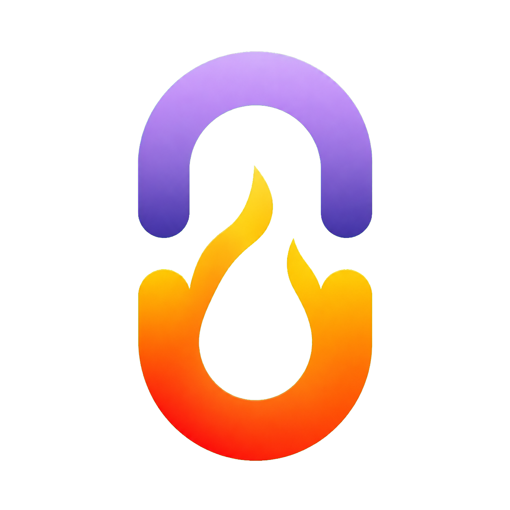

# Ember

<p align="center">
  
</p>

<p align="center">
  <strong>DeepSeek-V4-Flash inference for AMD Strix Halo</strong>
</p>

> [!IMPORTANT]
> **Ember is designed exclusively for AMD Strix Halo (`gfx1151`).** It is an
> intentionally focused engine for one GPU architecture and one model family,
> allowing the entire stack to be tuned for the best possible performance on
> that platform. It is not a general-purpose inference engine and does not
> support other GPUs.

Ember is a C inference server for DeepSeek-V4-Flash. It provides OpenAI Chat
Completions, OpenAI Responses, Anthropic Messages, and legacy Completions APIs
on one local endpoint.

## Requirements

- Native x86_64 Linux on AMD Strix Halo (`gfx1151`)
- Approximately 128 GiB unified memory
- At least 100 GiB free disk space
- Docker Engine with Docker Compose v2
- `/dev/kfd` and `/dev/dri` available to Docker

Docker Desktop, virtualized GPU passthrough, and other GPU architectures are not
supported.

## Start Ember

From the repository root:

```bash
scripts/preflight.sh && docker compose up -d
```

The first start pulls `ghcr.io/otheru-ai/ember:2026.8.10`, downloads the pinned
[DeepSeek-V4-Flash Strix Halo model and DSpark drafter](https://huggingface.co/otheru/DeepSeek-V4-Flash-Strix-Halo-GGUF)
(about 95 GiB combined), verifies both, and starts Ember at
`http://127.0.0.1:8080`. Interrupted downloads resume automatically.

Follow startup progress:

```bash
docker compose logs -f ember
```

Model loading can take several minutes. When the service is healthy, run:

```bash
scripts/smoke_test.sh --generate
```

Later starts need only:

```bash
docker compose up -d
```

To build the release image from source instead of pulling it:

```bash
docker compose -f compose.yaml -f compose.build.yaml up --build -d
```

Stop Ember with:

```bash
docker compose down
```

Downloaded models remain in `./models`; the persistent KV cache remains in
`./cache`.

## Send a request

```bash
curl http://127.0.0.1:8080/v1/chat/completions \
  -H 'Content-Type: application/json' \
  -d '{
    "model": "deepseek-v4-flash",
    "messages": [{"role": "user", "content": "Hello"}],
    "stream": false
  }'
```

Useful endpoints:

- `GET /health`
- `GET /status`
- `GET /v1/models`
- `POST /v1/chat/completions`
- `POST /v1/responses`
- `POST /v1/messages`
- `POST /v1/completions`

Ember has no built-in authentication and listens on loopback by default. Use an
authenticating reverse proxy before exposing it to another host.

## Configure

The defaults require no configuration. To change the port or host directories:

```bash
cp .env.example .env
```

Edit `.env`, then restart with `docker compose up -d`. Common settings are:

```dotenv
EMBER_PORT=8080
EMBER_MODELS_DIR=./models
EMBER_CACHE_DIR=./cache
```

Only the pinned quant and drafter are supported. They are not configurable,
and Ember always verifies both SHA-256 digests before start. See
[.env.example](.env.example) for every container setting.

## Coding agents

Ember is tested with Claude Code, Codex CLI, OpenCode, pi, and OMP. Their exact
provider configurations are in
[docs/client-compatibility.md](docs/client-compatibility.md).

The default base URL is `http://127.0.0.1:8080/v1` and the model ID is
`deepseek-v4-flash`.

## Develop and test

Open the full ROCm development container:

```bash
docker compose --profile dev run --rm --build ember-dev
```

Build and run the GPU-free test suite on any normal C/C++ host:

```bash
cmake -S . -B build
cmake --build build
ctest --test-dir build --output-on-failure
```

Build the real ROCm backend from the repository root with:

```bash
docker build --target dev -f docker/Dockerfile -t ember-rocm:7.14-dev .
scripts/build.sh
```

## Documentation

- [Operations and troubleshooting](docs/operations.md)
- [Client configuration](docs/client-compatibility.md)
- [Architecture](ARCHITECTURE.md)
- [Security policy](SECURITY.md)
- [Contributing](CONTRIBUTING.md)
- [Vendor provenance](engine/VENDOR.md)

Ember is licensed under the [MIT License](LICENSE). Model weights are distributed
separately under the license on their Hugging Face model card.
